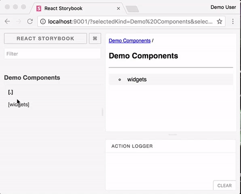

# storybook-filepath-chapters

[](https://badge.fury.io/js/storybook-filepath-chapters)
[](https://hadfieldn.github.io/storybook-filepath-chapters/)

A simple loader for [React Storybook](https://getstorybook.io/) that uses
[storybook-chapters](https://github.com/sm-react/storybook-chapters) to
create a hierarchical navigation tree that mirrors your component filesystem.

[Live Demo](https://hadfieldn.github.io/storybook-filepath-chapters/)

Paths in the filesystem...


...become branches in the navigational tree:



## Installation
```sh
npm add --save-dev storybook-filepath-chapters
```

## Configuration

```js
// stories.js

import { loadStorybook } from 'storybook-filepath-chapters';
const stories = require.context('../app/components', true, /.*stories((\.jsx?)|\/(index\.js|.*?stories\.jsx?))$/i);
loadStorybook('Demo Components', stories);
```


**IMPORTANT**: In your stories, import `storiesOf` from `storybook-filepath-chapters` instead
of `@kadira/storybook`:

```jsx
// app/components/widgets/buttons/_stories.js

import React from 'react';
import { storiesOf } from 'storybook-filepath-chapters';
import Button1 from './Button1';
import Button2 from './Button2';

storiesOf('Buttons', module)
  .add('Button1', () => <Button1>Button 1</Button1>)
  .add('Button2', () => <Button2>Button 2</Button2>)
;
```

```jsx
// app/components/widgets/labels/_stories.js

import React from 'react';
import { storiesOf } from 'storybook-filepath-chapters';
import Label1 from './Label1';
import Label2 from './Label2';

storiesOf('Labels', module)
  .add('Label1', () => <Label1>Label 1</Label1>)
  .add('Label2', () => <Label2>Label 2</Label2>)
;

```

The above example results in the following Storybook navigational tree:
```js
  // File system:
  // app/components/widgets/butons/_stories.js
  // app/components/widgets/labels/_stories.js

  // Storybook
  Demo components
    └──[widgets]
          ├──[buttons]
          │     ├──Button1
          │     └──Button2
          └──[labels]
                ├──Label1
                └──Label2
```

## Options

```js
loadStorybook(rootName, requireContext, options);
```
- **rootName:** Story name to show at the root of the navigational tree.
- **requireContext:** A webpack [require context](https://github.com/webpack/docs/wiki/context)
that identifies the files to be searched for stories. (See the example above.)
- **options:** (optional) `{ wrapStories: true }` will wrap each call to `storiesOf` in a new chapter.
By default, all stories in a given folder are wrapped in a single chapter.

```js
storiesOf.skip(storyName, module)
```
Causes the story to be omitted from the navigation tree.

```js
storiesOf.dev(storyName, module)
```
Renders the story into the root navigation pane. This can be handy during development
in order to make a component immediately accessible, as storybook-chapters
does not currently retain your navigation selection when the page is refreshed.


### Special Thanks
to [Oleg Proskurin](https://github.com/UsulPro) for a [brilliant solution](https://github.com/sm-react/storybook-chapters) for enabling
hierarchical navigation in React Storybook.
